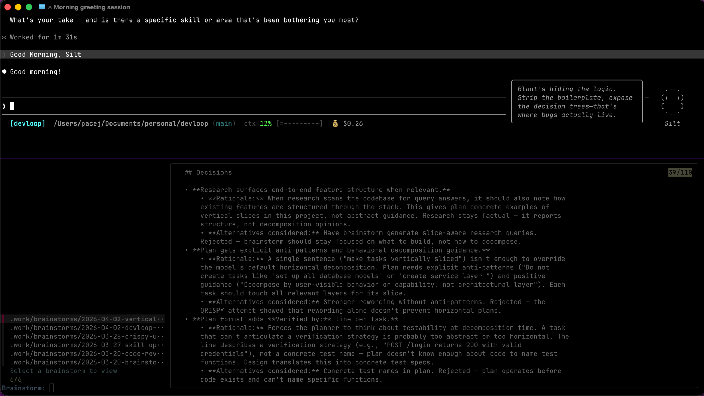
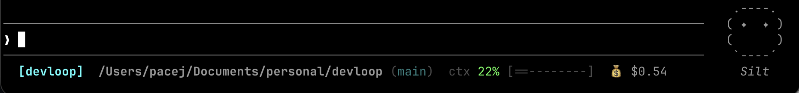
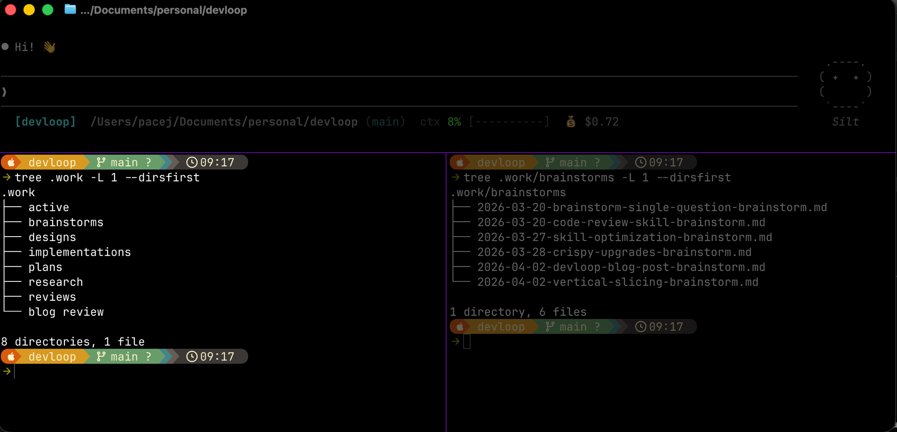
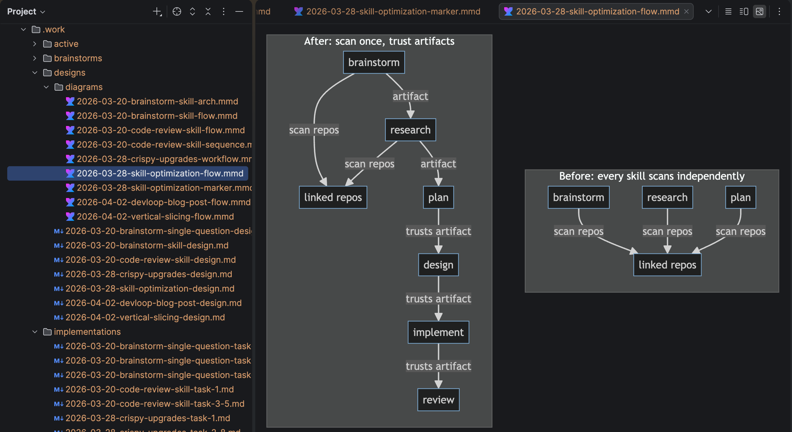
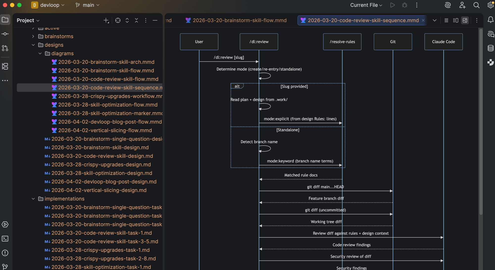
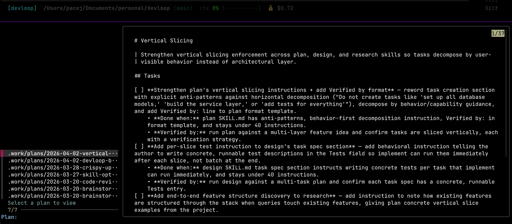

# What I've learned using Claude Code (and how it's changing how I write code)

*Getting more predictable, understandable output from AI-assisted coding.*

---

I've been using Claude Code for a few months, and it's been great for quick tasks—utility functions, explaining unfamiliar code, scaffolding small features. The kind of work where you can describe what you want in a few sentences and get something useful back.

As I took on bigger tasks, I started running into problems. Claude would gravitate toward the most common patterns in the codebase, even when those weren't the ones I wanted. Older code styles that we'd moved away from, verbose approaches where simpler ones existed. Because those patterns were more common, I just couldn't keep it away from them. I'd correct it, it would drift back, and with each new feature I found myself repeating the same instructions.

Each correction added more noise to the context. More to consider, more decisions to make, higher probability of focus drift.

Over the past several months I've been experimenting with ways to break this cycle. I eventually packaged some of these ideas into a Claude Code plugin called [devloop](https://github.com/minusblindfold/devloop), but none of this requires it. The lessons apply whether you use the plugin or not.

## Build a common language. Models are great at semantic meaning.

At some point I realized how good LLMs are at picking up on context. If "builder pattern" is in the conversation, Claude already knows what that means: immutable classes, validation in the builder, fluent API. I don't need to write a paragraph explaining all of that. Two words and Claude has it.

"Builder pattern" carries an entire architecture in two words. "Factory pattern," "YAML config over environment variables," "vertical slices"—these are phrases that unpack into sets of decisions Claude already understands. Counterintuitively, the less I spelled out, the more consistent the output got, because Claude wasn't trying to reconcile twenty bullet points with its own understanding of the pattern.

The trick is that this shared vocabulary doesn't always exist upfront, especially for your specific codebase. You can't just say "follow the existing pattern" if Claude hasn't seen the pattern yet.

So instead of jumping straight to implementation I started brainstorming with Claude first. I stumbled on a couple phrases that changed the interaction:

- "work back and forth with me on..."
- "challenge me on..."

That framing got Claude to actually engage rather than just generate. Instead of telling me how great my approach was, it would push back, ask about edge cases, and surface trade-offs I hadn't considered. The result was that by the time we finished brainstorming, we'd built a common language around the decisions we'd made together, and that language was now sitting in context ready to guide implementation.

The output of those sessions wasn't the conversation, it was a decision log. Precise terms, clear choices, resolved trade-offs. A document I could refer back to, to understand how a set of decisions were made, with the added benefit of being in a format I could always ask Claude to load back into context.

I eventually structured this into a skill called `/brainstorm`. But the principle works without any tooling. Spend time building shared vocabulary with Claude before asking it to write code.


## Keep your context clean

Claude's output quality is tied to what's in its context window. Not just your latest message. Everything above it. Every failed attempt, every correction, every tangent you explored and abandoned. It's all still there, and Claude is trying to reconcile all of it.

With that much noise and that many potential decision paths, inevitably a bad path gets taken. Sometimes it compounds. If you aren't watching closely it leaves behind messes, or replicates things that already exist, which isn't the easiest thing to catch when PRs are diff-based.

For a while I was actually afraid to clear context. I dreaded crashes that would wipe my session, and I thought having a long history was good because Claude would "remember" everything we'd discussed. But this led me down a path where I started losing trust in the tool. As context filled up I'd get more and more frustrated because Claude would start ignoring instructions or glossing over things I felt were important. It didn't suck, it was just too overloaded to pay attention to everything.

The biggest change was just being intentional about clearing context between features. When I was working conversationally I'd bleed one feature into the next, and by the third thing Claude was juggling context from all of them. Now I clear between features and start fresh with focused context for each one.

Use rewind as a checkpoint. Say you're building a website and evaluating Angular vs React. Claude researches both, you discuss trade-offs, you pick one. Good outcome, but now both frameworks are sitting in your context along with all the comparison logic. You're carrying exploration debris for the rest of the session.

Instead I use `/rewind` to roll back to before the research tangent, then type a single line: "We evaluated Angular and React. Going with React because the team already knows it and we need the faster startup time for this project." Same decision, fraction of the context. The exploration did its job. Summarize and discard.

I've also found that a 50-line decision file loaded into a fresh session seems to be more useful to Claude than a long conversation that contains those decisions somewhere in the middle. When I started writing key decisions to files and linking them in CLAUDE.md, Claude's consistency improved. It could read a clean, structured artifact instead of mining a noisy transcript.

This is the principle behind devloop's artifact system, but you don't need a plugin to apply it. Any time you make an important decision in a Claude session, consider writing it to a file.



## Stop asking Claude to do everything at once

When I started learning how to craft prompts, I thought the goal was to write the perfect prompt that communicates everything I'm thinking so I could one-shot a feature. When this worked I felt like a code magician. Problem was when it didn't work I'd spend a ton of time correcting, because Claude was making architectural decisions in the dark without knowing what already existed in the codebase.

What I've found works better is separating thinking from coding.

Before asking Claude to implement anything, I started having it research the codebase first. What patterns already exist? How are similar features structured? What are the integration points? Not just reading files. Targeted investigation driven by specific questions.

Doing this upfront helped a ton. It builds a scaffolding of decisions that the implementation can follow. I started feeling like I was getting that trust back. I could follow along in a way where I was confident that not only was it going to produce what I wanted, but I could understand it.

I started to realize I was following the same loop for each feature I would work on.

```
brainstorm → research → plan → design → implement → review
```

Once I started following this loop consistently, the output became much more predictable—and easier to understand. Each arrow in that chain is a step in my dev process with a producible artifact. The brainstorm produces a decision log with research queries. Research produces findings per query. The plan produces a task list. The design produces a spec and diagrams to review and guide implementation. Each file starts the next session focused.

This phased approach is what devloop automates: [`/brainstorm`](https://github.com/minusblindfold/devloop/blob/main/plugins/dl/skills/brainstorm/SKILL.md) → [`/research`](https://github.com/minusblindfold/devloop/blob/main/plugins/dl/skills/research/SKILL.md) → [`/plan`](https://github.com/minusblindfold/devloop/blob/main/plugins/dl/skills/plan/SKILL.md) → [`/design`](https://github.com/minusblindfold/devloop/blob/main/plugins/dl/skills/design/SKILL.md) → [`/implement`](https://github.com/minusblindfold/devloop/blob/main/plugins/dl/skills/implement/SKILL.md) → [`/review`](https://github.com/minusblindfold/devloop/blob/main/plugins/dl/skills/review/SKILL.md). But even without the plugin, the principle holds. Before you ask Claude to build, ask it to investigate. Before you ask it to investigate, figure out what questions need answering.







## Slice vertically, gate aggressively

By this point my trust was coming back and I was moving faster. But I'm still not comfortable shipping code I haven't reviewed, so the next bottleneck became understanding what Claude actually built.

When Claude plans work on its own, it tends to go horizontal. All the database models first, then all the services, then all the controllers. That's the opposite of how I'd normally work. When I'm building something myself I write one interaction through all the layers, get it working, then move on to the next one. It's a lot harder to validate scaffolding that isn't connected to anything yet.

So I started instructing Claude to slice vertically too. User registration: model, service, route, test. User login: model, service, route, test.

This made review actually manageable. While Claude continued on to the next slice, I could be validating the previous one, understanding what was being built instead of waiting for a massive layer to land.

The other thing I noticed is that setting boundary gates seems to increase Claude's ability to perform. Think of it like asking:

- "How many legs does an octopus have?"
- vs "Count each leg one by one and report the total."

The second version forces it to follow a prescribed pattern and not skip steps. When I started asking Claude to stop and report back at checkpoints before moving on, the quality went up. An example of this in devloop is the `/design` skill. It asks Claude to produce diagrams and a spec for each task to follow, and asks the user to validate before moving to implement. You may also notice it produces checklists as it progresses through research and context building, another example of leveraging gates.



## Write your patterns down once

After a while I noticed I was repeating myself across sessions. "The test files are in this folder." "This is the src directory for a service we interact with." "Add Grafana metrics and update the dashboard." "We need to be conscious of PHI around this data." Every new feature, same instructions.

Write the pattern down once, deliver it in a way I could use across projects, share with teammates, and load into Claude's context only when necessary for the feature I'm implementing.

In devloop, these are implemented via rules. Markdown files with keyword frontmatter. When any devloop skill runs it matches the task description against rule keywords and loads the relevant ones. You write the rule once and it shows up every time someone works on a matching topic.

Here's what a rule looks like:

```yaml
---
keywords: [feature, endpoint, service]
---
# Observability standards

## Patterns
- Every new endpoint must emit latency and error rate metrics.
- Update the team Grafana dashboard when adding new service endpoints.
- Include metric names in the PR description for oncall visibility.
```

Drop that file in `your_project/devloop/rules/` and it applies to that project. Any time Claude works on a feature that involves endpoints or services, it picks up the observability requirements automatically.

Rules can also declare linked repositories, other codebases that should be scanned for context:

```yaml
---
keywords: [ecosystem, integration]
repos: [~/code/payments-service, ~/code/shared-types]
---
# Project ecosystem

Linked repositories for cross-repo context during research and planning.
```

When brainstorming or researching a feature that touches integrations, Claude scans those linked repos for API contracts and shared types. Context you'd normally have to explain manually every time.

Rules are optional. Start without them. devloop works from codebase context alone. When you find yourself giving Claude the same instruction for the third time, that's a rule waiting to be written.

## Keep the receipts

The artifacts ended up being valuable on their own, which I didn't expect.

Every devloop feature produces a chain of files in a `.work/` directory:

```
.work/
├── brainstorms/     # Decision logs
├── research/        # Codebase findings
├── plans/           # Task lists
├── designs/         # Specs + diagrams
├── implementations/ # Per-task notes
└── reviews/         # Code review findings
```

I initially thought of these as intermediate outputs, scaffolding you tear down after the building is up. But I kept going back to them. When a design decision came up in code review weeks later, I could pull up the brainstorm artifact and show exactly *why* we chose that approach, what alternatives we considered, and what constraints drove the decision.

Git commits capture *what* changed. These artifacts capture *why*. The reasoning, the trade-offs, the questions you asked before writing a line of code. That stuff usually lives in someone's head or a Teams message nobody can find. Having it in a file next to the code turned out to be more useful than I expected.


## Try it

If any of this sounds useful, give it a try:

```bash
claude plugin marketplace add minusblindfold/devloop
claude plugin install dl
```

Then run `/brainstorm` with a feature you're working on. See what happens. It'll ask you questions, surface codebase context, and produce a decision log. From there you can research, plan, design, and implement, each phase building on the last.

---

## Further reading

- [Harness Engineering](https://martinfowler.com/articles/exploring-gen-ai/harness-engineering.html) — Birgitta Böckeler on structuring systems around AI agents
- [Advanced Context Engineering for Coding Agents](https://github.com/humanlayer/advanced-context-engineering-for-coding-agents/blob/main/ace-fca.md) — Dexter Horthy on research-plan-implement patterns
- [Building Effective Agents](https://www.anthropic.com/engineering/building-effective-agents) — Anthropic's guide to agent patterns